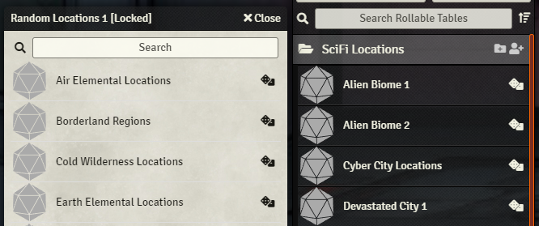

# Roll Table From Sidebar for Foundry VTT
This module allows rolling Random Tables directly from the sidebar and compendium folders.

Once the module is enabled, you will see a dice icon next to the rollable table name. Just click on it.

## Authors
[Originally created by U~Man](https://gitlab.com/mesfoliesludiques/foundryvtt-rolltable-from-sidebar)

Revived and Maintained by **JeansenVaars**

## Check out my other modules!
* Minimal UI
* Window Controls
* Actor Link Indicator
* Clipboard Image
* Drag Anything to Hotbar

# License
[MIT License](./LICENSE.md)

# Powered By

Thanks to JetBrains I can work on this project using **WebStorm**.