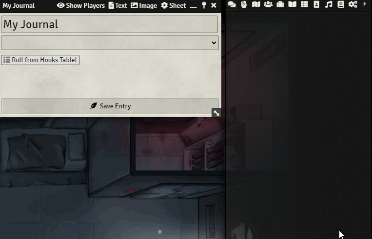

    
# Roll Table From Sidebar and Journal - Foundry VTT module
This module allows one-click draw Rollable Tables directly from the sidebar, compendium folders or when right-clicking a table link in a Journal Entry.

Direct roll from Sidebar

(Right-Click from Journal Entries)

## Authors
[Originally created by U~Man](https://gitlab.com/mesfoliesludiques/foundryvtt-rolltable-from-sidebar)

Revived and Maintained by **JeansenVaars**

## Check out my other modules!
* Minimal UI
* Window Controls
* Actor Link Indicator
* Clipboard Image
* Drag Anything to Hotbar

# License
[MIT License](./LICENSE.md)

# Powered By

Thanks to JetBrains I can work on this project using **WebStorm**.